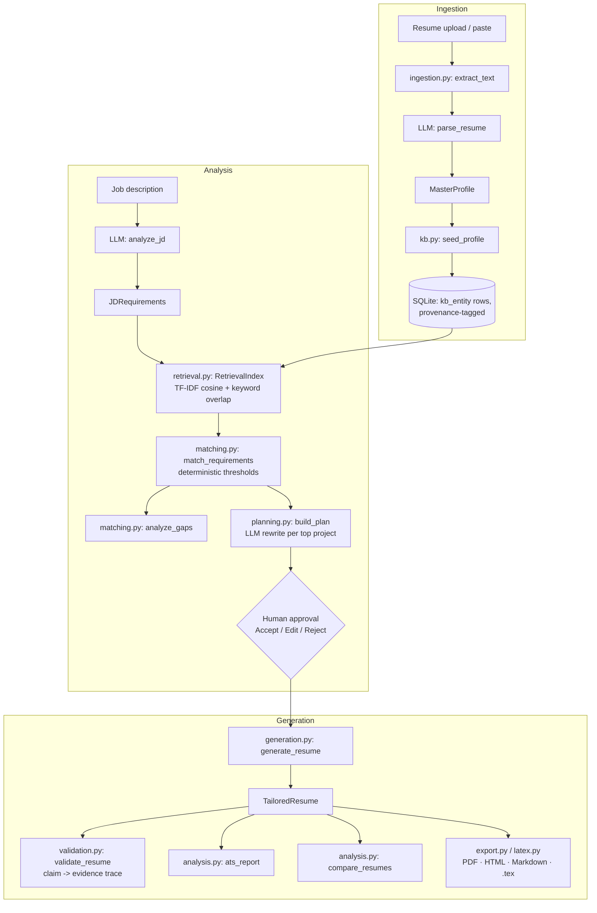

# Interview & Presentation Guide — Adaptive Resume Engineer

This is a study/viva handbook for presenting and defending the **Adaptive Resume
Engineer**: the RAG-powered resume-tailoring engine (CLAUDE.md V1 scope — resume + JD →
tailored, evidence-validated résumé). Every claim below was checked against the actual
code in this repository as of commit `85fc1eb` (see §0 for the verification method).

**Scope note.** This repository has grown beyond V1 into two later layers:
- **V2 — Opportunity Intelligence** (`opportunities_api.py`): real job discovery over
  Greenhouse/Lever feeds, reusing the V1 matching pipeline. Implemented and tested, but
  **not the subject of this guide** — see §25.
- **V3/V3.5 — Application Automation & remote browser worker** (`applications_api.py`,
  `worker_api.py`, `worker/worker.py`, Playwright): an application-filling/submission
  system with a state machine and a separate MacBook worker process. **Deliberately
  excluded from this guide** (§25) — if an interviewer asks about it, see §25 for how to
  answer honestly without presenting it as your subject matter.

Study order: read §1–§2 first (pitch + architecture), then §6–§13 (RAG/LLM deep dives —
this is where the hard questions land), then §24 (walkthrough) once, then skim §25–§30 the
night before.

---

## 0. How this document was verified

Inspected directly: `backend/app/*.py` (all 18 modules), `backend/app/providers/*.py`,
`frontend/src/**/*.tsx|ts`, `tests/*.py` (ran the full suite), `docs/decisions/*.md`,
`docs/rag-evaluation.md`, `data/fixtures/*`, `requirements.txt`, `frontend/package.json`,
`README.md`. Where a doc file and the code disagreed, **the code is what's described
here**. Numbers in §29 come from actually running `pytest`, not from reading test names.

---

## 1. The pitch

### 1a. 30-second answer — "Tell me about your project"

> I built a system that takes a candidate's master résumé and a job description, and
> produces a role-specific tailored résumé — without an LLM just freestyling a new one.
> The candidate's experience is stored as a structured knowledge base with retrievable
> entities — skills, projects, experience — each tagged with provenance. When you give it
> a JD, it extracts structured requirements, retrieves the relevant evidence with hybrid
> search, classifies each requirement as a strong match, partial match, or gap, and
> proposes a modification plan — which project to emphasize, what skill to add — that the
> candidate has to approve before anything is written. After generation, every claim in
> the résumé is traced back to evidence and unsupported claims get flagged. So it's RAG
> plus human-in-the-loop plus a validator, not "LLM, write me a résumé."

### 1b. 2-minute answer — "Explain your project in detail"

> The core problem: a candidate's real experience is broader than any one resume — my
> own resume fixture is an iOS developer who's also done backend (FastAPI/PostgreSQL) and
> edge-AI (1D-CNN on a microcontroller). Applying for a Data Engineer role means
> resurfacing the backend/data parts of that experience and de-emphasizing the SwiftUI
> parts — a manual process every job-seeker does by hand.
>
> The architecture has three layers. First, **ingestion**: a resume (PDF/DOCX/text) goes
> through an LLM parse into a structured `MasterProfile`, then gets broken into individual
> `KBEntity` rows — one per skill, project, experience item — each with a `content` field
> used for retrieval and a `status` field (`ORIGINAL`, `AI_SUGGESTED`, `USER_CONFIRMED`,
> etc.) for provenance. Second, **analysis**: the JD goes through one LLM call
> (`analyze_jd`) to get structured requirements, then a hybrid retrieval index — TF-IDF
> cosine similarity plus keyword overlap — searches the KB per requirement, and
> deterministic threshold logic classifies each as `STRONG_MATCH` / `PARTIAL_MATCH` /
> `MISSING` / etc. Third, **generation**: an LLM rewrites the top-ranked projects for the
> role (grounded only in that project's own evidence — never invented), the candidate
> approves or edits each suggestion, and only then does resume generation run, followed by
> a validator that traces every claim back to its supporting entity.
>
> The key design decision is that the LLM never controls scoring, provenance, or
> validation — those are deterministic Python. The LLM's job is JD parsing, project
> rewriting, and summary composition; everything that needs to be reproducible and
> auditable is code.

### 1c. 5-minute answer — see §24 (walkthrough), which is this answer with the trace
attached to a concrete example (Parkezy → Data Engineer).

---

## 2. Architecture at a glance



| Concern | Choice | Why |
|---|---|---|
| API | FastAPI + Pydantic | thin controller layer; all logic in stage modules |
| Frontend | React + Vite + TypeScript + Tailwind v4 | client-only dashboard, no SSR need — ADR-005 |
| Storage | SQLite (stdlib `sqlite3`, no ORM) | one person's KB is dozens of rows — ADR-001 |
| Vector search | numpy brute-force cosine | KB is ~20–80 entities; exact and instant — ADR-002 |
| LLM | `LLMProvider` interface: mock / Gemini / Groq | testable offline, swappable — ADR-003 |
| Embeddings | `EmbeddingProvider`: local TF-IDF / Gemini | no torch dependency by default — ADR-004 |
| Export | Jinja2 → LaTeX → PDF (tectonic), + reportlab PDF/HTML/Markdown | deterministic renderer over structured model |

**Key point:** the mock LLM provider and local TF-IDF embedder are the *defaults*, not
stubs bolted on for testing — the entire pipeline runs and is unit-tested with zero API
keys (ADR-003). Gemini/Groq are opt-in via `LLM_PROVIDER`.

---

## 3. Candidate Knowledge Base & provenance

**Implemented.** `backend/app/models.py`, `backend/app/kb.py`, `backend/app/db.py`.

The resume is never stored as one blob. `kb.seed_profile()` takes a parsed
`MasterProfile` and writes one `KBEntity` row per skill / project / experience item /
education / certification / achievement into a single `kb_entity` SQLite table
(`entity_type` column distinguishes them). Each entity carries:

```text
KBEntity
├── entity_type   (skill | project | experience | education | certification | achievement)
├── content       — the text actually used for embedding + keyword search
├── data          — type-specific structured fields (JSON), e.g. a project's
│                   technologies/responsibilities/metrics
├── status        — provenance (see below)
└── source        — "master_resume" | "user_confirmation" | "manual_entry"
```

**Key point (interview-ready):** for a `SkillItem`, `content` is deliberately just the
skill *name*, not its category/level — the code comment explains why: "a code like 'ml'
must never be mistaken for a skill mention" if category text leaked into the retrieval
field.

### Provenance — the `Status` enum

```text
ORIGINAL        — extracted from the master resume, or entered by the candidate
AI_SUGGESTED    — proposed by the system, not yet approved
USER_CONFIRMED  — candidate accepted an AI suggestion as-is
USER_EDITED     — candidate accepted an AI suggestion with edits
GENERATED       — produced by the generation step
REJECTED        — candidate rejected it
```

`SUPPORTED_STATUSES = {ORIGINAL, USER_CONFIRMED, USER_EDITED}` — this constant is used
everywhere retrieval/matching decides what counts as *real* evidence
(`retrieval.build_index`, `pipeline._supported_entities`). `AI_SUGGESTED` and `REJECTED`
entities are never retrieved as evidence for a *new* JD analysis, but validation (§7)
still checks against *all* entities including unapproved ones, specifically to catch a
generated résumé that leaked an unapproved claim.

Editing is real, not cosmetic: `PATCH /api/entities/{id}` and `DELETE
/api/entities/{id}` exist and are exercised by the Profile screen (§17) — a candidate can
correct what the LLM parser got wrong before it ever reaches retrieval.

---

## 4. JD Understanding

**Implemented.** `backend/app/prompts.py::jd_analysis`, `providers/llm.py`.

One LLM call turns raw JD text into a `JDRequirements` object:

```json
{
  "role": "Data Engineer",
  "required_skills": ["python", "sql", "postgresql", "etl", "rest"],
  "preferred_skills": ["airflow", "spark", "dbt"],
  "responsibilities": ["Build and maintain reliable data pipelines", "..."],
  "technologies": [...],
  "domain_terms": ["data engineering"],
  "keywords": [...],
  "experience_expectations": ["3+ years of experience preferred."]
}
```

**Normalization** happens in `text_utils.py::normalize_skill`, an alias table:
`"postgres"`, `"postgresql database"`, `"psql"` all collapse to `postgresql`; `"k8s"` →
`kubernetes`; `"nlp"` → `natural language processing`. This is a fixed dict, not an LLM
call — CLAUDE.md §8B explicitly asks for this distinction (collapse *surface forms*, never
collapse *genuinely different technologies*).

The mock provider's `analyze_jd` (used offline, see §9) is a real rule-based JD parser,
not a stub: it buckets lines into required/preferred using cue phrases (`"must have"` vs
`"nice to have"` vs `"bonus"`), pulls responsibilities via action-verb detection while
filtering out marketing prose (`"we are"`, `"join our team"`), and extracts a role title
from the first few lines. It's genuinely useful without any API key, which is why it's the
default — not merely a test fixture.

---

## 5. RAG Deep Dive

### What is RAG, and why does this project need it

Retrieval-Augmented Generation means: don't ask the LLM to produce an answer from its own
memory/context window alone — retrieve the *specific, relevant* source material first,
then have the LLM reason over just that material.

**Why "send the whole resume + whole JD to Gemini" isn't sufficient here:**
1. **Selectivity.** A JD for "Data Engineer" doesn't need the candidate's SwiftUI project
   details in the generation context — sending everything encourages the LLM to include
   irrelevant content or dilute the relevant parts.
2. **Auditability.** If the LLM sees the entire profile as unstructured text, there's no
   way to trace *which* fact backed *which* generated sentence. Retrieval against
   individual `KBEntity` rows gives every fact a stable `entity_id`, so a generated bullet
   can be linked back (`evidence_entity_id`) to exactly the entity it came from — that
   link is what §7's validator checks.
3. **Determinism where it matters.** Deciding "is PostgreSQL a strong match" from a raw
   LLM read of the whole resume is unreliable and non-reproducible. Making it a retrieval
   score against a fixed threshold (§6) makes it deterministic and testable — see
   `tests/test_retrieval_matching.py`.

### The actual pipeline (traced to code)

```text
Resume
  → ingestion.extract_text()            (pypdf / python-docx / plain decode)
  → LLM: parse_resume()                 (one call → MasterProfile)
  → kb.seed_profile()                   (MasterProfile → N provenance-tagged KBEntity rows)
  → SQLite kb_entity table

JD
  → LLM: analyze_jd()                   (one call → JDRequirements)
  → retrieval.RetrievalIndex(entities)  (per-request: TF-IDF fit + embed the KB)
  → index.search(requirement)           (per requirement: cosine + keyword fusion, top_k=3)
  → matching.match_requirements()       (deterministic thresholding → STRONG/PARTIAL/.../MISSING)
  → matching.analyze_gaps()             (everything not STRONG_MATCH)
  → planning.build_plan()               (LLM rewrite for top-3 relevant projects; deterministic
                                          skill-gap suggestions)
  → HUMAN APPROVAL (accept/edit/reject each suggestion)
  → generation.generate_resume()        (assembles from SUPPORTED_STATUSES entities +
                                          approved rewrites only; one more LLM call for the summary)
  → validation.validate_resume()        (every claim traced to entity provenance)
  → analysis.ats_report() / compare_resumes()
```

There is **no persistent vector index** — `RetrievalIndex` is built fresh per request
from the candidate's current entities (ADR-002). At KB scale (dozens of entities) this is
instant and exact; a persistent ANN index would be solving a scale problem this product
doesn't have.

---

## 6. Hybrid Retrieval Deep Dive

**Implemented.** `backend/app/retrieval.py`, `backend/app/providers/embeddings.py`,
`backend/app/text_utils.py::keyword_overlap`.

### Semantic component

`LocalTfidfEmbedder` (default) fits TF-IDF over the candidate's own KB corpus per request
— term frequency × inverse document frequency, L2-normalized rows, so a dot product is
cosine similarity. It's numpy, no external ML library. `GeminiEmbedder`
(`text-embedding-004` over REST, SQLite-cached) is opt-in via `EMBEDDING_PROVIDER=gemini`.

### Keyword component

`keyword_overlap(query, doc)` — Jaccard-style overlap of content tokens (stopwords and
pure numbers stripped): `|query_tokens ∩ doc_tokens| / |query_tokens|`. This matters
because exact technology names (`PostgreSQL`, `FastAPI`, `1D-CNN`, `Supabase`, `SwiftUI`)
need to match precisely — a semantic embedder alone can conflate technologies that are
lexically distinct but topically similar.

### Fusion

```python
score = semantic_weight * cosine_sim + keyword_weight * keyword_overlap
# defaults: semantic_weight=0.6, keyword_weight=0.4 (config.py, both env-overridable)
```

This is the actual formula in `RetrievalIndex.search()` — a simple weighted linear
combination, not a learned reranker. Both weights are `Settings` fields, tunable without a
code change.

### The honest evaluation result (docs/rag-evaluation.md — read this before your interview)

A small labeled benchmark (`tests/evaluation/labels.py`) maps JD requirements to the KB
entities that *should* be retrieved (e.g. `postgresql → {Parkezy, iOS Developer at
Freelance}`). Measured Hit@3/Hit@5 for semantic-only, keyword-only, and hybrid rankings.

- **Hit@3 = 100%** for every labeled technology term — verified by
  `test_retrieval_hits_labeled_evidence`.
- **The honest caveat, stated plainly in the docs:** because the default embedder is
  itself lexical (TF-IDF), the "semantic" and "keyword" signals are highly correlated —
  the current offline benchmark **cannot demonstrate hybrid's headline benefit** (bridging
  paraphrase/synonyms via dense embeddings). That needs `EMBEDDING_PROVIDER=gemini`, which
  is explicitly marked **Not Tested** in the eval doc.
- Where the two *do* diverge, keyword wins a real case: for the query `"feature
  engineering"`, TF-IDF-semantic ranks the candidate's **degree** entry top-1 (spurious
  match on the word "engineering"), while keyword and hybrid correctly rank the **Setu AI**
  project top-1 (it actually did feature engineering).

**If asked "why should I believe hybrid retrieval is better than semantic alone" —** give
this exact answer, including the caveat. It's a stronger answer than claiming an
unqualified win, because it shows you evaluated it rather than assumed it.

---

## 7. Gap Analysis & Matching — the deterministic core

**Implemented.** `backend/app/matching.py`. This is the module CLAUDE.md §9 is about:
classification here is **not** an LLM call.

```python
STRONG  = 0.45   # fused retrieval score
PARTIAL = 0.22
WEAK    = 0.10
```

```python
def _classify(requirement, kind, best, exact):
    if exact:                      return STRONG_MATCH   # exact skill-set membership
    if best >= STRONG:             return STRONG_MATCH
    if best >= PARTIAL:            return PARTIAL_MATCH
    if best >= WEAK:
        if kind in (required, preferred, technology):
            return USER_CONFIRMATION_REQUIRED   # ambiguous — ask, don't assume
        return WEAK_MATCH
    return MISSING
```

Two things worth calling out in an interview:
1. **`exact` short-circuits to `STRONG_MATCH`.** If the normalized requirement is
   literally in the candidate's skill set (`candidate_skill_set()`, built from
   `extract_skills()` over every entity), the retrieval score is bypassed entirely —
   there's no reason to trust a fuzzy score over a confirmed exact membership check.
2. **`USER_CONFIRMATION_REQUIRED` is a distinct bucket from `MISSING`.** A weak-but-present
   signal for a required/preferred skill isn't silently classified either way — it's
   routed to "ask the candidate," which is what CLAUDE.md §18 asks for
   (`USER_CONFIRMATION_REQUIRED` as its own gap category).

`analyze_gaps()` is a one-liner: everything that isn't `STRONG_MATCH` is a gap, with a
`suggested_action` string looked up from a fixed dict per match status (e.g. `MISSING` →
*"No evidence — do not fabricate. Flag as a genuine gap or ask the candidate."*).

---

## 8. Modification Planning & Human-in-the-Loop

**Implemented.** `backend/app/planning.py`, `backend/app/models.py::ApprovalAction`.

`planning.build_plan()` produces exactly two kinds of *approvable* suggestions —
deliberately limited to the two things that could introduce an unsupported claim:

| Type | Trigger | Grounding |
|---|---|---|
| `REWRITE` | top-3 JD-relevant projects (by retrieval score against `f"{role} {top JD skills}"`) that also have ≥1 skill overlapping the JD | LLM `rewrite()` call, given ONLY that project's own evidence text — the prompt explicitly forbids adding technologies/metrics not in the evidence |
| `ADD_SKILL` | every requirement classified `USER_CONFIRMATION_REQUIRED` or `MISSING` | none — by construction there's no evidence, so it's presented as a question, never auto-applied |

Everything else in the plan — `emphasize` (STRONG/PARTIAL matches), `deemphasize`
(candidate skills the JD doesn't ask for), `reorder` (projects ranked by relevance) — is
**not individually approvable**; it's deterministic guidance consumed directly by
generation, since it can't introduce a false claim (it only reorders/filters real facts).

### The approval state machine

```python
_TRANSITION = {
    ACCEPT: USER_CONFIRMED,
    EDIT:   USER_EDITED,
    REJECT: REJECTED,
}
```

`POST /api/suggestions/{id}/approve` calls `planning.apply_approval()`, which:
1. Updates the suggestion row's status via the table above.
2. **If** the suggestion was an `ADD_SKILL` and the outcome was `USER_CONFIRMED` or
   `USER_EDITED`, it calls `kb.add_confirmed_skill()` — this inserts a **new** `KBEntity`
   with that status (never `ORIGINAL` — the code comment is explicit: *"provenance stays
   honest"*). That new entity is immediately real evidence for retrieval/generation on
   this candidate going forward.

`generate_for_job()` only pulls `REWRITE` suggestions whose status is `USER_CONFIRMED` or
`USER_EDITED` into `approved_rewrites` — an `AI_SUGGESTED` (undecided) or `REJECTED`
rewrite is structurally impossible to reach the generator. This is what makes "nothing is
applied until you accept it" a real invariant, not a UI convention.

### Simple explanation (for a non-technical interviewer)

> The AI never edits your résumé directly. It writes sticky notes — "here's how I'd
> rephrase this project for this role," "you didn't mention Docker, do you actually have
> that experience?" — and you accept, edit, or throw away each one. Only accepted notes
> become part of the résumé.

---

## 9. LLM Architecture

**Implemented.** `backend/app/providers/llm.py`, `gemini_llm.py`, `groq_llm.py`,
`prompts.py`.

`LLMProvider` (ABC) defines the domain operations business logic calls:
`analyze_jd`, `parse_resume`, `rewrite`, `compose_summary`, `compose_cover_letter`,
`answer_question`. Concrete subclasses implement one low-level method, `_complete(system,
user) -> str`; the base class handles prompt rendering (from `prompts.py`) and — for
structured operations — JSON parsing + Pydantic validation (`_complete_json`).

| Provider | Transport | Notes |
|---|---|---|
| `mock` (default) | none | fully deterministic, rule-based (§4, §9); every domain method implemented for real, not stubbed |
| `gemini` | REST via `httpx`, no SDK | model default `gemini-3.6-flash`, configurable via `LLM_MODEL`; auth switchable between `?key=` query param and `Authorization: Bearer` (`GEMINI_AUTH`) |
| `groq` | REST via `httpx`, no SDK | same `LLMProvider` interface |

Selected by `LLM_PROVIDER` env var; `get_llm_provider()` is the single factory function —
no business-logic file imports `gemini_llm` or `groq_llm` directly.

### Structured output handling (`_parse_json`)

Real LLMs don't reliably emit bare JSON. `_parse_json`:
1. Strips markdown code fences if present.
2. Slices from the first `{` to the last `}` (handles leading/trailing prose).
3. `json.loads` → on failure, raises `LLMError` (not a silent fallback).
4. `_drop_nulls()` recursively strips explicit `null` values before Pydantic validation —
   an LLM emitting `"level": null` for an optional field shouldn't fail validation when the
   schema default (`level: str = ""`) would have been fine.
5. `schema.model_validate()` — on failure, raises `LLMError` with the Pydantic error
   message (not swallowed).

### Error handling / retries

`providers/_http.py::post_json` retries on 429/5xx/timeout up to `LLM_MAX_RETRIES` (default
2), with a configurable `LLM_TIMEOUT` (default 60s). `tests/test_provider_failures.py`
(7 tests) exercises this. Failures surface as `LLMError`, which the API layer maps to
HTTP 502 (`api.py`: every route that touches the LLM catches `LLMError`).

### Which tasks use the LLM vs. which are deterministic

| LLM (semantic reasoning / generation) | Deterministic (Python) |
|---|---|
| Parse resume text → structured profile | Chunking the profile into KB entities |
| Parse JD text → structured requirements | Retrieval scoring (TF-IDF cosine + keyword overlap) |
| Rewrite a project for a target role | Match classification thresholds (STRONG/PARTIAL/...) |
| Compose the résumé summary paragraph | Gap categorization |
| Compose a cover letter / application answer | Provenance transitions (approval state machine) |
| | Claim validation (evidence trace) |
| | ATS/alignment scoring |
| | Original-vs-tailored diff |
| | Skill normalization / alias collapsing |

This split is deliberate — see §10.

---

## 10. Why not use an LLM for everything?

**Interview-ready answer:**

> Scoring, provenance, and validation need to be reproducible and testable — the same JD
> against the same profile should always classify PostgreSQL the same way. An LLM call is
> non-deterministic (even at low temperature) and expensive to unit-test — you can't
> assert `test_retrieval_hits_labeled_evidence` against a live API call reliably or
> cheaply. Every deterministic stage in this pipeline has a test that pins its exact
> behavior; the LLM-touching stages are tested for *shape* (does it return valid JSON
> matching the schema) rather than exact content, because content legitimately varies by
> provider/model.

Concretely: **cost** (JD analysis is 1 LLM call regardless of KB size, not
N calls; `pipeline.match_jd`'s docstring explicitly protects against this scaling badly
across many opportunities), **reliability** (an LLM call can 429/timeout/return malformed
JSON; matching logic can't be allowed to fail the same way), **debuggability** (a wrong
`STRONG_MATCH` classification can be traced to a specific threshold constant and score, not
re-prompted and hoped-away), and — the CLAUDE.md framing — **hallucination reduction**: if
the LLM decided what counts as a "strong match," a plausible-sounding but wrong
classification is much harder to catch than a wrong number crossing a named threshold.

---

## 11. Anti-Hallucination Design — Claim Validation

**Implemented.** `backend/app/validation.py`.

```text
Original candidate information (ORIGINAL)
        ↓
AI suggestions (AI_SUGGESTED) — rewrites, skill additions
        ↓
Candidate reviews → Accept / Edit / Reject
        ↓
Approved modification (USER_CONFIRMED / USER_EDITED)
        ↓
generate_resume() — draws ONLY from SUPPORTED_STATUSES entities + approved rewrites
        ↓
validate_resume() — post-hoc claim trace, independent of generation
        ↓
ClaimStatus per claim: SUPPORTED_BY_ORIGINAL | SUPPORTED_BY_USER_CONFIRMATION |
                       AI_SUGGESTED_NOT_APPROVED | UNSUPPORTED
```

Validation is a **second, independent pass** — it doesn't trust that generation only used
approved evidence; it re-derives support from scratch:

1. `_skill_support(entities)` builds a `skill → best ClaimStatus` map across every entity
   the candidate has (any provenance, including rejected-adjacent `AI_SUGGESTED` ones) —
   `REJECTED` entities are explicitly excluded.
2. For every skill/bullet in the generated résumé, `_classify()` extracts the skills the
   text mentions (`extract_skills`) and takes the **worst** (least-supported) status among
   them — a bullet's baseline provenance (its linked evidence entity) is only a fallback
   for skill-*less* text; a rewrite that introduces an unsupported skill is flagged even if
   its source entity was `ORIGINAL`. This is the key anti-hallucination mechanism: **you
   can't launder an unsupported claim through evidence that supports something else.**
3. **Invented-metric check:** every number in the summary (`\d+(?:\.\d+)?%?`) is checked
   against the token set of all supporting evidence — a number that appears nowhere in the
   candidate's actual data is flagged `UNSUPPORTED` with reason *"Numeric claim not found
   in candidate evidence."*

Concrete example (matches the pattern in the task spec, adapted to this codebase):

```text
Claim: "Reduced average slot-search time in user testing" (Parkezy achievement)
  → present verbatim in the ORIGINAL project data → SUPPORTED_BY_ORIGINAL

Claim (hypothetical, if a rewrite introduced it): "Reduced pipeline latency by 40%"
  → "40" not found in any evidence token set → UNSUPPORTED,
    reason: "Numeric claim not found in candidate evidence."
```

`ValidationReport` aggregates `supported` / `unsupported` / `needs_approval` counts, shown
in the Resume screen's **Validation** tab (§17) with every flagged claim surfaced, not
buried.

---

## 12. JD Alignment / ATS-style Analysis

**Implemented.** `backend/app/analysis.py::ats_report`. Named "JD alignment" in the UI
deliberately — the code and docs never claim it predicts real ATS software behavior.

```python
_WEIGHTS = {"skill": 0.40, "keyword": 0.20, "requirement": 0.25, "project": 0.15}
overall = sum(components[k] * weight for k, weight in _WEIGHTS.items())
```

- `skill_coverage` — fraction of `required_skills` present in the resume's skill list/text
- `keyword_coverage` — fraction of extracted JD keywords present in resume token set
- `requirement_coverage` — fraction of all matched requirements that are STRONG/PARTIAL
- `project_relevance` — capped function of how many project bullets survived filtering

`potential_issues` is a plain list of human-readable warnings (missing required skills
named explicitly, unsupported-claim count from the validator, "resume is very short").
Weights are named constants in one place, not scattered magic numbers — trivially tunable.

**Say this if asked "is this a real ATS score":** No — it's a self-consistent, explainable
coverage indicator computed from the same requirements/evidence the rest of the pipeline
already has, not a simulation of any real ATS product (Workday, Greenhouse, Taleo, etc.),
and the docs are explicit that it shouldn't be sold as one.

---

## 13. Explainability

**Implemented.** `GET /api/jobs/{job_id}/explain?requirement=...` →
`analysis.explain_requirement()`. Given a requirement string, it looks up the matching
`RequirementMatch`, returning its status, fused relevance score, the plain-English reason
string produced during classification, and the evidence list (name, type, snippet, score,
status) that fed the score. The **Analysis** screen's evidence panel (§17) is a direct
render of this — clicking any requirement chip shows exactly this trace.

---

## 14. Resume Comparison

**Implemented.** `analysis.compare_resumes()` — `difflib.SequenceMatcher` line diff
between the master-profile-as-résumé baseline (`render_master_markdown`, every `ORIGINAL`
entity rendered flat, no tailoring) and the generated tailored résumé's markdown, plus a
skill-set delta (`skills_added` / `skills_dropped`, via `extract_skills` on each markdown).
Shown as the **Compare** tab (§17): "Foregrounded for this role" vs "Dropped as not
relevant."

---

## 15. Export

**Implemented**, five formats, all from the same `TailoredResume` Pydantic model —
generation never targets a specific output format:

| Route | Format | Mechanism |
|---|---|---|
| `/export.md` | Markdown | `render_markdown()` — plain string building |
| `/export.html` | Standalone HTML | `render_html()` — hand-built, escaped |
| `/export.pdf` | PDF | `reportlab` — always available, no external dependency |
| `/export.tex` | LaTeX source | Jinja2 template (`kartik_professional`) with LaTeX-safe delimiters + full character escaping (`latex.latex_escape`) |
| `/export.latex.pdf` | Professional PDF | compiles the `.tex` via an external engine (tectonic/pdflatex) if present |

The LaTeX path is deliberately best-effort: `/export.tex` needs no compiler and always
works; `/export.latex.pdf` returns a friendly `503` ("professional PDF renderer isn't
available... use Download PDF (standard)") if no engine is on `PATH`, rather than leaking
a raw compiler log. `LatexCompileError` still logs the engine output server-side for
debugging. The reportlab PDF is the guaranteed fallback.

Also exported: the **original** (untailored) master profile itself, as `.tex`/`.pdf`
(`/api/candidates/{id}/export.original.*`) — so a candidate can get a clean master-profile
PDF through the same professional template.

---

## 16. Frontend

**Implemented.** React 18 + Vite 6 + TypeScript 5 + Tailwind CSS v4 (ADR-005 — chosen over
Next.js because the product is a client-only dashboard against a JSON API; no SSR/SEO
need). No state-management library — a single `useEngine()` hook (`store.ts`) holds all
client state via `useState`, exposed as one `Engine` object passed down to panel
components. Routing is a 6-line hand-rolled `usePathView()` over the History API (`/`,
`/opportunities`, `/applications`) — no router dependency for three static views.

### The four V1 screens (`frontend/src/panels/`)

| Step | Component | What it does | Backend call |
|---|---|---|---|
| 1. Profile | `Profile.tsx` | Upload/paste resume or load the sample fixture; edit/add/delete KB entities inline; edit candidate header fields | `POST /api/ingest`, `POST /api/candidates`, `PATCH /api/entities/{id}` |
| 2. Analysis | `Analysis.tsx` | Paste/upload a JD (or pick a bundled sample), see matches grouped by status, click any requirement for the full evidence trace | `POST /api/jobs` (→ `pipeline.analyze_job`), `GET /api/jobs/{id}/explain` |
| 3. Modifications | `Modifications.tsx` | Review each `REWRITE`/`ADD_SKILL` suggestion; Accept / Edit / Reject | `POST /api/suggestions/{id}/approve` |
| 4. Résumé | `Resume.tsx` | Tabs: Preview / Alignment (JD score) / Validation (flagged claims) / Compare (vs. original); export links; "save as reusable role view" | `POST /api/jobs/{id}/generate`, `GET /api/jobs/{id}/export.*` |

A `Stepper` nav gates progression (`enabled[i]`) — you can't jump to Analysis without a
candidate loaded, can't jump to Résumé without an analysis. Panels stay mounted once
visited (hidden via CSS, not unmounted) specifically so an in-flight async action isn't
killed by switching tabs.

Two more nav items exist — **Opportunities** and **Applications** — backed by the V2/V3
layers this guide deliberately doesn't cover (§25).

### Frontend testing

`vitest` + `@testing-library/react` + `jsdom`. `App.test.tsx` plus per-panel test files
exist (`Opportunities.test.tsx`, `Applications.test.tsx` — both out of this guide's scope).
Build: `tsc && vite build`, type-checked in CI-equivalent fashion via `npm run typecheck`.

---

## 17. Backend — module map

```text
backend/app/
├── api.py            FastAPI routes. Thin — validates input, calls pipeline/stage
│                      modules, returns Pydantic models. No business logic here.
├── models.py          All Pydantic domain models — the shared vocabulary (Status,
│                      KBEntity, JDRequirements, ModificationPlan, TailoredResume, ...).
├── pipeline.py         Orchestration: analyze_job() and generate_for_job() — the two
│                      flows the API drives. Deterministic stages recompute freely on
│                      every call; only approval state persists.
├── ingestion.py        PDF/DOCX/text extraction + validation (size, extension allowlist).
├── kb.py               MasterProfile → provenance-tagged KBEntity rows.
├── retrieval.py         RetrievalIndex — hybrid search (§6).
├── matching.py          Deterministic requirement matching + gap analysis (§7).
├── planning.py          Modification plan + approval state machine (§8).
├── generation.py        Assembles TailoredResume from approved evidence only (§ generation).
├── validation.py        Post-generation claim validation (§11).
├── analysis.py           ATS scoring, explainability, resume comparison (§12–14).
├── export.py            reportlab PDF + HTML rendering.
├── latex.py             Jinja2 → LaTeX → PDF, with full character escaping.
├── text_utils.py         Shared deterministic NLP: tokenize, skill alias table,
│                      extract_skills, keyword_overlap — used by matching, retrieval,
│                      validation, ATS, and the mock LLM provider alike.
├── prompts.py            Versioned prompt templates, one function per LLM operation.
├── db.py                SQLite persistence, raw sqlite3, no ORM.
├── config.py             Environment-based Settings (pydantic-settings); no hardcoded
│                      secrets or model names elsewhere.
├── providers/
│   ├── llm.py            LLMProvider ABC + MockLLMProvider (real, not a stub).
│   ├── gemini_llm.py       Gemini REST implementation.
│   ├── groq_llm.py         Groq REST implementation.
│   ├── embeddings.py       EmbeddingProvider ABC + LocalTfidfEmbedder.
│   ├── gemini_embeddings.py Gemini embeddings, SQLite-cached.
│   └── _http.py            Shared retry/timeout HTTP helper.
├── opportunities_api.py   V2 — out of scope, see §25.
├── applications_api.py    V3 — out of scope, see §25.
└── worker_api.py          V3.5 — out of scope, see §25.
```

Request lifecycle for the core flow: `api.py` route → `pipeline.py` orchestrator function
→ one or more stage modules (`retrieval` → `matching` → `planning` / `generation` →
`validation` → `analysis`) → Pydantic response model serialized straight back out. No
service/repository indirection beyond `db.py` — deliberately, per ADR-001, since the scale
doesn't justify it yet.

---

## 18. Database / Storage

**Implemented: SQLite**, stdlib `sqlite3`, direct queries — no ORM, no migration
framework, no repository layer (ADR-001: "the candidate KB is a single person's profile —
Postgres buys nothing at this scale yet"). `DATABASE_URL` can point at a `postgres://` DSN
in production (a `psycopg[binary]` driver is present in `requirements.txt` for that
deployed path — see `docs/database.md`), but the default and the interview-relevant path
is SQLite.

**pgvector is NOT implemented.** There is no vector column, no vector extension, no ANN
index anywhere in this codebase. Retrieval is a per-request in-memory numpy matrix
(§6, ADR-002). If asked "why not pgvector" — the honest answer is ADR-002's: the KB is too
small (tens of entities) for an ANN index to earn its complexity; the seam to add one later
is `RetrievalIndex`/`EmbeddingProvider`, not the storage layer.

### Core V1 tables

| Table | Purpose |
|---|---|
| `candidate` | one row per candidate — name/contact/header fields |
| `kb_entity` | the knowledge base — every skill/project/experience/etc. row, with `status`, `source`, JSON `data_json` for type-specific fields |
| `job` | one row per JD analysis — raw text, extracted role, `requirements_json`, and (once generated) `resume_json` |
| `suggestion` | one row per modification suggestion, keyed by a job-scoped slug id (e.g. `"14-rewrite-parkezy"`), carrying its approval `status` |
| `role_profile` | named, reusable snapshots of an analyzed job — a *view* over the master profile, not a duplicate candidate record |
| `embedding_cache` | `(provider, text_hash) → vector_json`, used by the Gemini embedder to avoid re-embedding unchanged text |

`opportunity`, `search_preferences`, `application_batch`, `discovery_run` tables exist for
V2/V3 (§25) — not part of the V1 schema this guide is scoped to.

---

## 19. End-to-End Walkthrough (concrete example)

Uses the bundled fixtures verbatim: `data/fixtures/master_profile.json` (candidate: Kartik
Sanghi, "iOS Developer with backend, data and edge-AI experience," projects **Parkezy**
[iOS + FastAPI + PostgreSQL], **Setu AI** [1D-CNN edge-AI], **PortfolioKit** [pure
SwiftUI]) against `data/fixtures/jd_data_engineer.txt`.

1. **Seed/upload.** `POST /api/candidates/seed-fixture` (dev) or a real
   upload → `ingestion.extract_text` → `LLM.parse_resume` → `MasterProfile`. Not persisted
   yet — the candidate reviews it first.
2. **Persist.** `POST /api/candidates` → `kb.seed_profile()` writes ~12 skill rows, 3
   project rows, 1 experience row, etc., all `status=ORIGINAL`.
3. **JD in.** The Data Engineer JD text is submitted with `POST /api/jobs`.
4. **JD analysis.** One `LLM.analyze_jd` call → `required_skills` includes `python`,
   `sql`, `postgresql`, `etl`, `rest`; `preferred_skills` includes `airflow`, `spark`,
   `dbt`.
5. **Retrieval.** For the requirement `"postgresql"`, `RetrievalIndex.search()` scores
   every KB entity; **Parkezy** (which explicitly lists PostgreSQL, has "Designed the
   PostgreSQL schema and data access layer" as a responsibility) and the **Freelance iOS
   Developer** experience entry score highest.
6. **Matching.** `postgresql` is in `candidate_skill_set()` verbatim → `exact=True` →
   `STRONG_MATCH` regardless of the fused score. `airflow`/`spark`/`dbt` have no
   supporting evidence anywhere → `MISSING`.
7. **Gap analysis.** `airflow`, `spark`, `dbt` become `GapItem`s with the reason "No
   supporting evidence in the current profile" and action "do not fabricate."
8. **Modification plan.** Parkezy ranks top by relevance to `"Data Engineer python sql
   postgresql etl rest"` and shares JD skills (`postgresql`, `rest`) → an LLM `REWRITE`
   suggestion is generated, grounded only in Parkezy's own evidence text — e.g. reframing
   toward "backend integration, persistent data, structured data flow" and away from
   SwiftUI/mobile-UI details, matching the exact CLAUDE.md §5 example. `PortfolioKit`
   (pure SwiftUI, zero JD-skill overlap) gets **no** rewrite suggestion — it's filtered out
   by the `if not proj_skills: continue` guard in `planning.build_plan`. Separately, `ADD_SKILL`
   suggestions appear for `airflow`/`spark`/`dbt` — the candidate must confirm, they are
   never auto-added.
9. **Human review.** The candidate accepts the Parkezy rewrite, edits the wording
   slightly, and rejects the `spark` suggestion (they don't actually have that
   experience) — three different `ApprovalAction`s, three different outcomes in
   `_TRANSITION`.
10. **Generation.** `generate_resume()` reads only `SUPPORTED_STATUSES` entities plus the
    one approved (edited) rewrite; PortfolioKit is likely filtered by the relevance-score
    cutoff (`score >= 0.08`) since it shares nothing with the JD.
11. **Validation.** Every résumé bullet is re-traced to its supporting entity's
    provenance; the edited Parkezy rewrite is `SUPPORTED_BY_USER_CONFIRMATION` (via
    `USER_EDITED`); anything that slipped in unsupported would be flagged `UNSUPPORTED`.
12. **ATS/alignment.** `skill_coverage` reflects PostgreSQL/Python/SQL/REST/ETL present,
    Airflow/Spark/dbt (rejected/unconfirmed) absent from `missing_skills`.
13. **Compare.** `skills_added` shows what got surfaced for this role vs. the untailored
    master profile; `skills_dropped` shows SwiftUI-specific terms de-emphasized.
14. **Export.** Candidate downloads the professional LaTeX PDF.

---

## 20. Libraries & Technologies

| Library | Role | Why chosen | Alternative considered |
|---|---|---|---|
| **FastAPI** | API framework | async-native, Pydantic-integrated request/response validation, auto OpenAPI | Flask (less native typing/validation) |
| **Pydantic v2** | schema/validation everywhere: domain models, LLM structured-output validation, Settings | one validation story end-to-end — the same `BaseModel` type is the DB row shape, the API response shape, and the LLM output schema | manual dict validation |
| **pydantic-settings** | env-based config | typed `.env` loading, matches Pydantic idiom already in use | `python-dotenv` + manual parsing |
| **numpy** | retrieval math | brute-force cosine at KB scale needs nothing heavier (ADR-002) | a vector DB (rejected — over-engineering at this scale) |
| **httpx** | LLM/HTTP client | one dependency for both providers' REST calls; no vendor SDK lock-in (ADR-003) | official `google-generativeai`/`groq` SDKs (adds vendor coupling) |
| **pypdf**, **python-docx** | resume/JD text extraction | pure-Python, no system dependencies | `pdfplumber`/`textract` (heavier) |
| **reportlab** | fallback PDF export | pure-Python — no LaTeX/wkhtmltopdf system dependency, always works | LaTeX-only (fragile without a system engine) |
| **Jinja2** | LaTeX templating | needed LaTeX-safe delimiters anyway (curly braces collide with Jinja defaults); already a FastAPI transitive dep | string templates by hand |
| **sqlite3** (stdlib) | persistence | zero-install, real SQL, sufficient at single-candidate scale (ADR-001) | SQLAlchemy + Postgres (deferred until multi-tenant) |
| **psycopg[binary]** | prod Postgres driver | only imported when `DATABASE_URL` is a `postgres://` DSN (deployed persistence) | — |
| **pytest** | backend tests | standard, fixture-based, matches FastAPI's own testing docs | unittest (more boilerplate) |
| **React 18 + Vite 6 + TS 5** | frontend | client-only dashboard; Vite's build is fast and simple (ADR-005) | Next.js (rejected — SSR machinery unneeded) |
| **Tailwind CSS v4** | styling | small hand-rolled primitives covered the needed components without the full shadcn/Radix dependency surface | shadcn/ui (heavier than needed) |
| **vitest + @testing-library/react** | frontend tests | Vite-native test runner, no separate Jest config | Jest |
| **playwright** | (V3, out of scope) browser automation | — | — |

**Why not LangChain/LlamaIndex?** Both are RAG orchestration frameworks; this pipeline's
retrieval is ~60 lines of numpy + a Jaccard overlap function, and its "chains" are two or
three explicit, testable Python function calls per flow (`pipeline.py`). A framework would
add abstraction and indirection to a fixed, small pipeline without adding capability —
same reasoning as ADR-002 (don't add infrastructure to solve a scale problem you don't
have).

**Why not OpenAI?** Not a technical rejection — Gemini and Groq were chosen for their
generous free tiers during development (explicit in CLAUDE.md §10: "do not assume a
provider's free-tier limits are permanent"). The `LLMProvider` abstraction means adding an
OpenAI-backed provider is one new file implementing `_complete()`.

---

## 21. Architectural Decisions

All five ADRs live in `docs/decisions/`; summarized here in interview form (problem →
decision → reason → tradeoff → alternative):

| ADR | Problem | Decision | Tradeoff accepted | Alternative rejected |
|---|---|---|---|---|
| 001 | CLAUDE.md names Postgres; no Postgres/Docker locally | SQLite via stdlib `sqlite3` | no concurrent writers, no pgvector | PostgreSQL (deferred, not abandoned — `db.py` is the single seam) |
| 002 | CLAUDE.md suggests pgvector/vector DB | numpy brute-force cosine, rebuilt per request | index rebuilds every request (fine at ~dozens of entities) | pgvector / FAISS / Chroma (textbook over-engineering at this scale) |
| 003 | Must not couple to one LLM vendor; must be testable with no API keys | `LLMProvider` ABC + a *load-bearing* deterministic mock as default | adding an LLM task = adding an interface method (fine for a fixed V1 pipeline) | a generic prompt-router abstraction (less clear for fixed operations) |
| 004 | Dev shouldn't depend on paid inference; install should stay light | `EmbeddingProvider` ABC, local TF-IDF default | TF-IDF is lexical, not truly semantic — won't bridge unrelated synonyms | `sentence-transformers` by default (pulls torch, heavy) |
| 005 | CLAUDE.md names Next.js; product is a client-only dashboard | Vite + React + TS + Tailwind, hand-rolled primitives | no SSR/SEO (irrelevant for a single-user authenticated tool) | Next.js (SSR/RSC machinery buys nothing here) |

**Pattern across all five:** every ADR follows the same shape — CLAUDE.md names a more
elaborate default, the actual decision is simpler, and the reasoning is explicit about
*why* the simpler option is sufficient *at this stage* plus *where the seam is* if it
later isn't. That consistency is itself a good answer to "how do you make architecture
decisions" — pick the smallest thing that's correct, name the upgrade path.

---

## 22. Interview Question Bank

### Level 1 — Basic

**Q: What problem does your project solve?**
A candidate's real experience is broader than any single résumé; tailoring a résumé to
each JD by hand is repetitive and easy to do poorly. This automates the *tailoring*, not
the *lying* — it reframes real evidence, never invents new evidence.

**Q: What is RAG?**
Retrieve the specific relevant source material for a query, then have the LLM reason over
just that material — rather than relying on the LLM's own memory or an unfiltered context
dump. See §5.

**Q: Why did you build this?**
To automate a real, tedious, error-prone manual process (reframing one's experience per
role) while keeping the output auditable and honest — every generated claim traceable to
real evidence.

**Q: What is the role of the LLM?**
JD parsing, resume parsing, per-project rewriting (grounded in that project's own
evidence), and prose composition (summary/cover letter). Never scoring, never provenance,
never validation — see §9/§10.

### Level 2 — Project understanding

**Q: Walk me through the architecture.** → §2, §19.

**Q: How does the resume become a knowledge base?** → §3. One `KBEntity` row per
skill/project/experience item, each with a `content` field for retrieval and a `status`
for provenance, not one text blob.

**Q: How is a JD analyzed?** → §4. One LLM call → structured `JDRequirements`; alias
normalization is a fixed dict, not an LLM call.

**Q: How does matching work?** → §7. Fused retrieval score against three named
thresholds, with an exact-membership short-circuit and a distinct "ask the candidate"
bucket.

**Q: How does gap analysis work?** → §7. Everything not `STRONG_MATCH` is a gap, with a
category-specific suggested action.

### Level 3 — Technical

**Q: How does hybrid retrieval work?** → §6. `0.6 * cosine_similarity + 0.4 *
keyword_overlap`, both weights configurable.

**Q: Why embeddings?** They capture topical/semantic similarity beyond exact keyword
overlap — in principle. (Be ready for the honest caveat in §6: the *default* embedder is
TF-IDF, itself lexical — true dense-semantic benefit is measured with
`EMBEDDING_PROVIDER=gemini`, and that measurement is explicitly not yet done.)

**Q: What is cosine similarity?** The cosine of the angle between two vectors — for
L2-normalized vectors, it's just their dot product; used here because it's scale-invariant
(document length doesn't skew the score).

**Q: Why keyword search as well?** Exact technology names matter for resume matching —
`PostgreSQL` needs to match `PostgreSQL`, not just "something database-related." §6's
`feature engineering` example is the concrete, tested case where keyword correctly beats
pure semantic.

**Q: How does provenance work?** → §3. A six-state enum threaded through every entity and
every generated claim; `SUPPORTED_STATUSES` gates what counts as usable evidence.

**Q: How do you validate generated claims?** → §11. Independent second pass:
per-skill best-provenance map, worst-status-wins per claim, plus a numeric-claim check
against the evidence token set.

**Q: Where is the LLM used? Where is deterministic logic used?** → §9 table.

### Level 4 — System design

**Q: How would you scale this to a million users?**
The current design is explicitly single-candidate-scale (ADR-001/002: SQLite,
per-request in-memory retrieval). At real multi-tenant scale: swap `db.py` for Postgres
(the seam ADR-001 names), move retrieval behind a persistent ANN index (pgvector/FAISS)
behind the existing `RetrievalIndex`/`EmbeddingProvider` interface (the seam ADR-002
names), and cache embeddings more aggressively (the `embedding_cache` table already does
this for the Gemini embedder — extend the pattern to local embeddings if TF-IDF's
per-request refit becomes a bottleneck).

**Q: How would you move from SQLite to PostgreSQL/pgvector?**
`db.py` is the only file with SQL — no ORM to fight. Swap the connection layer, add a
`pgvector` column to `kb_entity`, and implement a `PgvectorRetrievalIndex` behind the same
interface `RetrievalIndex` already exposes (`search(query, top_k, entity_types)`) so
`matching.py`/`generation.py` need zero changes.

**Q: How would you support multiple candidates concurrently?**
Already schema-supported (`candidate_id` foreign key on every table) — the gap is
concurrent-writer safety, which SQLite doesn't give you for free. That's exactly the
Postgres migration trigger named in ADR-001.

**Q: How would you reduce LLM cost?**
JD analysis is already one call regardless of KB size (not per-entity). Cache JD-analysis
results by JD text hash (same pattern as `embedding_cache`). Batch project-rewrite calls
into one multi-project prompt instead of one call per top-3 project if that becomes the
dominant cost.

**Q: How would you improve retrieval quality?**
Run `EMBEDDING_PROVIDER=gemini` and re-measure Hit@K on paraphrased requirements — this is
the exact next step `docs/rag-evaluation.md` names as untested. Add a `sentence-transformers`
local embedder behind the same interface for an offline dense-semantic comparison.

**Q: How would you handle provider outages?**
`LLMError` already surfaces cleanly (502) rather than corrupting state; the natural
next step is a provider fallback chain (`LLM_PROVIDER` tries Gemini, falls back to Groq)
behind `get_llm_provider()` — not built, but the abstraction makes it a small addition.

### Level 5 — Challenging

**Q: Why is this actually RAG and not an LLM wrapper?**
Because the LLM never sees the candidate's full profile as free context — it only ever
sees retrieved, scored evidence for a specific project/requirement, and the retrieval
step (embedding + keyword fusion + thresholding) is itself the majority of the pipeline's
logic and is fully deterministic and unit-tested independent of any LLM call.

**Q: Why not just send the whole resume to Gemini?**
Selectivity, auditability, determinism — see §5's three numbered reasons. Concretely: you
lose the ability to say "this bullet came from entity #42, status ORIGINAL" if the LLM
free-composes from an unstructured blob.

**Q: What happens if retrieval returns the wrong project?**
The fused score is visible and explainable (§13 `/explain` endpoint) — a wrong result is
diagnosable (was the semantic score wrong, the keyword score, or both?), and it doesn't
silently become a resume claim: matching still runs its threshold logic, and validation
still independently re-checks every claim afterward.

**Q: How do you know your generated resume is grounded?**
`validate_resume()` — a second pass, independent of generation, that re-derives support
per skill from entity provenance and flags the worst case per claim. It's not "trust the
prompt," it's a code-level check with a test (`tests/test_validation_ats.py`).

**Q: What prevents hallucinated achievements?**
The rewrite prompt (`prompts.py::rewrite`) explicitly instructs "use ONLY facts supported
by the provided evidence... do not add technologies, metrics or claims that are not
supported" — but that's a prompt, which is not a guarantee. The actual guarantee is
downstream: `validate_resume()`'s worst-status-wins logic and the numeric-claim check
catch what the prompt fails to prevent.

**Q: What if the JD uses terminology that doesn't exactly match the resume?**
`normalize_skill()`'s alias table handles known surface-form variants (Postgres ↔
PostgreSQL). Beyond known aliases, the fused retrieval score (not exact match alone) is
what surfaces related-but-differently-worded evidence — that's PARTIAL_MATCH's whole
purpose, and it's why matching isn't pure string equality.

**Q: What happens when Gemini and Groq produce different outputs?**
Both are validated against the same Pydantic schema before being trusted — `_parse_json`
rejects anything that doesn't fit `JDRequirements`/`MasterProfile`/etc., regardless of
provider. Content quality differences aren't unified beyond that; the interface guarantees
*shape*, not *identical content*, which is the correct guarantee for two different models.

**Q: Why should the LLM not control scoring/provenance?**
Reproducibility and auditability — §10's answer, verbatim.

**Q: What would you change with 100x more users?**
Postgres + pgvector (§ Level 4 answer above), plus moving retrieval index construction out
of the request path (persistent index, invalidated on KB write) instead of rebuilding
per-request.

**Q: What's the biggest weakness of your current architecture?**
Two honest ones: (1) the default embedder is lexical (TF-IDF), so the retrieval
evaluation can't yet demonstrate hybrid retrieval's actual headline benefit — dense
semantic bridging — until run against a real embedding model (§6, explicitly flagged in
the eval doc). (2) SQLite has no concurrent-writer story, which is fine for a single-
candidate tool but is the first thing that breaks at multi-tenant scale.

---

## 23. "Why did you choose this?" — quick reference

See the table in §20 for the full grid. One-liners for the fastest-fired questions:

- **Why FastAPI?** Native Pydantic integration — the same model validates API I/O and LLM
  structured output.
- **Why React/Vite over Next.js?** Client-only dashboard against a JSON API; no SSR need
  (ADR-005).
- **Why SQLite over Postgres?** Single-candidate scale; zero install; real seam to migrate
  later (ADR-001).
- **Why numpy over a vector DB?** Tens of entities — brute-force cosine is exact and
  instant; a vector DB would be unused infrastructure (ADR-002).
- **Why TF-IDF over a neural embedder by default?** Keeps install light (no torch),
  deterministic, offline-testable; heavier embedders are opt-in behind the same interface
  (ADR-004).
- **Why hybrid retrieval, not semantic-only?** Exact technology names matter for resumes;
  §6's `feature engineering` case is the concrete proof.
- **Why Gemini AND Groq?** Provider abstraction was a CLAUDE.md requirement; both have
  workable free tiers for development. Neither is hardcoded into business logic.
- **Why not OpenAI?** Not rejected on merit — free-tier economics during development; the
  abstraction makes adding it trivial.
- **Why not LangChain/LlamaIndex?** The actual retrieval pipeline is small, explicit, and
  independently testable; a framework adds indirection without adding capability at this
  scale.
- **Why Pydantic?** One validation model for domain data, API contracts, and LLM
  structured-output parsing — a single source of truth for shape.
- **Why pytest?** Standard, fixture-friendly, matches FastAPI's own docs.
- **Why Docker (in the deployed path)?** Not used for the core V1 dev loop at all — only
  relevant to the V3.5 worker deployment, which is out of this guide's scope (§25).

---

## 24. Demo Script

### 3-minute demo

1. **Load the sample candidate** (Profile tab, "Use sample candidate"). *Say:* "This is a
   real fixture — an iOS developer who also has backend and edge-AI experience."
2. **Paste the Data Engineer sample JD** (Analysis tab, sample button) → Analyze. *Say:*
   "One LLM call extracts structured requirements; everything after this is retrieval and
   deterministic scoring."
3. **Click a `MISSING` requirement** (e.g. Airflow). Show the evidence panel: empty, with
   the explicit "not invented" reasoning. *Demonstrates:* anti-hallucination stance, up
   front.
4. **Go to Modifications**, show the Parkezy rewrite suggestion — current vs. suggested,
   with the reasoning. Accept it. *Say:* "Nothing reaches the résumé without this click."
5. **Generate**, land on the Résumé tab → **Validation** sub-tab. *Say:* "Every claim here
   is traced back to evidence; anything unsupported would show up right here, not
   silently in the résumé."

### 7–10 minute demo (adds to the above)

6. Show the **Alignment** tab — JD coverage breakdown, explicitly labeled "a coverage
   indicator, not a guaranteed ATS result."
7. Show **Compare** — foregrounded vs. dropped skills, visually.
8. Go back to **Profile**, edit an entity inline — *say:* "The candidate can correct
   anything the parser got wrong before it's ever retrieved."
9. Export the **Professional PDF** — show the LaTeX-rendered output.
10. Briefly open `docs/rag-evaluation.md` on screen and read the honest caveat about
    TF-IDF vs. dense embeddings out loud — *this single move signals engineering maturity
    better than any feature.*

**Do not demo:** the Opportunities or Applications tabs, unless specifically asked — and
if asked, answer per §25, don't improvise a deeper demo of them.

---

## 25. Do Not Claim

The following exist in this repository's git history and file tree but are **out of scope
for this presentation** — do not walk an interviewer through their architecture, do not
imply they're the subject of your project pitch, and do not build a demo around them:

- **V2 — Opportunity Intelligence** (`opportunities_api.py`, `docs/opportunity-*.md`,
  `Opportunities.tsx`): this one is genuinely **implemented** (real Greenhouse/Lever job
  discovery reusing the V1 matching pipeline, with its own tests). If asked directly
  "what else is in the repo," it is honest to say it exists and briefly what it does — but
  it is not the material this guide prepares you to deep-dive, and CLAUDE.md itself scopes
  it as post-V1 work.
- **V3 / V3.5 — Application Automation & remote browser worker** (`applications_api.py`,
  `worker_api.py`, `worker/worker.py`, Playwright, `Applications.tsx`, and every doc under
  `docs/application-*.md`, `docs/browser-agent.md`, `docs/*-worker.md`): a
  fill/review/submit state machine with a separate MacBook browser worker process. This
  code **exists and has tests** (`test_application_engine.py`,
  `test_application_playwright.py`, `test_worker_api.py`, `test_worker_e2e.py`, etc.) —
  it is not vaporware — but it is **explicitly excluded from this interview's subject
  matter** by design. If pressed: "the repository has grown a job-application-automation
  layer on top of the resume engine; that's a separate system with its own design tradeoffs
  I'm not prepared to defend in this session — the résumé engine is what I want to walk
  you through." Do not narrate its field-mapping, state machine, or CAPTCHA-handling logic
  as if it's part of your rehearsed material.
- **pgvector / a real vector database** — not implemented anywhere (§18). Retrieval is
  numpy brute-force cosine.
- **A genuinely dense/neural default embedder** — the default is TF-IDF (lexical), not
  semantic in the deep-learning sense (§6, §18). Gemini embeddings are opt-in and their
  retrieval benefit over TF-IDF is explicitly **not yet measured**.
- **"Guaranteed ATS pass" claims** — the alignment score is a self-consistent coverage
  indicator, not a simulation of any real ATS product (§12).
- **A learned/trained reranker** — fusion is one fixed weighted-sum formula, not a model
  (§6).

---

## 26. Current Limitations

| Limitation | Detail | Improvement path |
|---|---|---|
| Retrieval quality claim is incomplete | Hit@3=100% is real but measured against a lexical default embedder correlated with the keyword signal — hybrid's dense-semantic benefit is unmeasured (`docs/rag-evaluation.md`) | Run the same eval with `EMBEDDING_PROVIDER=gemini`; add an opt-in `sentence-transformers` embedder for an offline comparison |
| Single-writer storage | SQLite has no real concurrent-writer story | Migrate `db.py` to Postgres when multi-tenant use is real (ADR-001 names this explicitly) |
| No persistent vector index | `RetrievalIndex` rebuilds per request | Fine at current scale (ADR-002); add pgvector/FAISS behind the same interface if KB size grows by orders of magnitude |
| Free-tier LLM dependency | Gemini/Groq free tiers aren't guaranteed to persist (CLAUDE.md §10 calls this out explicitly) | Provider abstraction already makes adding a paid/alternate provider a one-file change |
| Small evaluation dataset | The labeled retrieval benchmark (`tests/evaluation/labels.py`) covers a handful of JD-requirement → evidence pairs for one candidate fixture | Expand the label set across more candidate profiles/domains as real usage data accumulates |
| Alias table is hand-maintained | `text_utils._ALIASES`/`_CANONICAL` is a fixed dict, not learned | Acceptable at current scope; would need a more systematic approach (ontology or embedding-based synonymy) at much larger vocabulary scale |
| Frontend has no dedicated e2e/browser test suite for the V1 flow | Only unit/component tests (vitest) exist for the panels | Add Playwright-based UI e2e coverage for the four-step V1 flow specifically (distinct from the V3.5 application-automation Playwright usage) |

---

## 27. Future Roadmap

### Implemented
Everything in §3–§19 of this guide (resume ingestion, KB, RAG retrieval, JD analysis, gap
analysis, modification planning + human approval, generation, claim validation, JD
alignment analysis, explainability, comparison, multi-format export, role-view snapshots).
Also implemented but out of this guide's scope: V2 Opportunity Intelligence (job
discovery), V3/V3.5 application automation + remote browser worker (§25).

### Near-term improvements
- Run and publish the dense-embedding (`EMBEDDING_PROVIDER=gemini`) retrieval evaluation
  the eval doc already calls out as the next step.
- Expand the labeled evaluation set.
- Postgres migration path exercised end-to-end (not just documented in ADR-001).

### Future ideas — **not implemented, do not present as done**
- A more systematic skill/technology ontology beyond the hand-maintained alias table.
- Learned reranking instead of a fixed weighted-sum fusion formula.
- Multi-tenant concurrent access (needs the Postgres migration first).
- Anything in the V2/V3/V3.5 layers evolving further (job discovery, application
  automation) — explicitly out of this guide's presentation scope regardless of their
  actual implementation state in the repository (§25).

---

## 28. Technical Glossary

- **RAG (Retrieval-Augmented Generation)** — retrieve relevant source material before
  generation, instead of relying on the model's unaided memory or an unfiltered context
  dump.
- **Embedding** — a numeric vector representation of text such that similar texts have
  similar vectors.
- **Vector search / semantic search** — finding similar items by comparing embedding
  vectors (here: cosine similarity).
- **Hybrid retrieval** — combining semantic (embedding) search with lexical (keyword)
  search into one fused score.
- **TF-IDF** — Term Frequency × Inverse Document Frequency; a lexical vectorization that
  weights terms by how distinctive they are to a document within a corpus.
- **Cosine similarity** — the cosine of the angle between two vectors; for L2-normalized
  vectors this equals their dot product.
- **Reranking** — reordering an initial retrieval result set with a second, often more
  expensive, scoring pass. (Not implemented here — fusion is a single-pass weighted sum.)
- **Chunking** — splitting a document into smaller retrievable units. Here: one `KBEntity`
  per skill/project/experience item, not arbitrary text chunks.
- **Metadata** — structured fields attached to a retrievable unit (entity type, domain,
  status, source) used for filtering, independent of the free-text content.
- **Prompt** — the instruction text sent to an LLM; versioned in `prompts.py` here.
- **Structured output** — LLM output constrained to (and validated against) a defined
  schema, here Pydantic models.
- **Provenance** — a record of where a piece of information came from and what's happened
  to it since (`Status` enum, §3).
- **Hallucination** — an LLM stating something not supported by its input/evidence as if
  it were fact; the failure mode §11's validator exists to catch.
- **LLM (Large Language Model)** — here, Gemini/Groq/a deterministic mock, behind one
  interface.
- **Provider abstraction** — an interface (`LLMProvider`, `EmbeddingProvider`) that
  decouples business logic from a specific vendor implementation.
- **Pydantic** — Python data-validation library; used here for domain models, API
  contracts, and LLM output validation, all through the same mechanism.
- **FastAPI** — Python async web framework, Pydantic-native request/response validation.
- **API** — the FastAPI routes in `api.py`.
- **Frontend / Backend** — React/Vite client vs. FastAPI/Python server, communicating over
  JSON HTTP.

---

## 29. Project Metrics (verified)

Ran directly, not inferred from filenames:

```text
$ pytest tests/ -q
189 passed, 1 skipped, in 13.89s
```

Of the 189, a majority exercise the core V1 pipeline this guide covers
(`test_api.py`, `test_binary_ingestion.py`, `test_db_dialect.py`, `test_ingestion_jd.py`,
`test_export_profile.py`, `test_pipeline_e2e.py`, `test_latex_render.py`,
`test_provenance.py`, `test_retrieval_matching.py`, `test_provider_failures.py`,
`test_text_utils.py`, `test_validation_ats.py`, `tests/evaluation/`) — roughly **74 test
functions** by direct count (`grep -c "^def test_"`). The remainder
(`test_application_*`, `test_worker_*`, `test_opportunities_api.py`,
`test_opportunity_processing.py`, `test_discovery.py`, `test_sources_http.py`,
`test_batches_packages.py`, ~**104 test functions**) cover the V2/V3/V3.5 layers this guide
excludes (§25).

| Metric | Count | Note |
|---|---|---|
| Backend Python modules (`backend/app/*.py`) | 18 | excludes `providers/` subpackage |
| LLM providers | 3 | mock (default), Gemini, Groq |
| Embedding providers | 2 | local TF-IDF (default), Gemini |
| Supported resume/JD input formats | 3 | PDF, DOCX, plain text/Markdown |
| Export formats | 5 | Markdown, HTML, reportlab PDF, `.tex`, LaTeX-compiled PDF |
| V1-scoped test functions (approx.) | ~74 | direct grep count, see above |
| Total test functions in repo (all V1–V3.5) | 178 (function defs) / 189 (pytest-collected, incl. parametrized) | |
| Frontend V1 panel components | 4 | Profile, Analysis, Modifications, Resume |
| ADRs | 5 | all in `docs/decisions/` |

Approximate/labeled as such per the task's instruction not to invent precision.

---

## 30. Validation Results

| Claim | Status | Evidence |
|---|---|---|
| Backend test suite passes | **VERIFIED** | `pytest tests/` run directly: 189 passed, 1 skipped |
| Frontend type-checks/builds | **NOT VERIFIED IN THIS SESSION** | `npm run build`/`typecheck` not re-run while writing this guide; `App.test.tsx` + panel tests exist in the repo |
| Retrieval Hit@3 = 100% on labeled tech terms | **VERIFIED** | `docs/rag-evaluation.md`, backed by `test_retrieval_hits_labeled_evidence` |
| Hybrid retrieval's dense-semantic benefit over keyword-only | **NOT VERIFIED / explicitly flagged Not Tested** | `docs/rag-evaluation.md`, requires `EMBEDDING_PROVIDER=gemini` run |
| Mock LLM provider fully implements the domain interface offline | **VERIFIED** | read `providers/llm.py` — every `LLMProvider` method has a real `MockLLMProvider` implementation, not a stub |
| Real Gemini/Groq API calls | **NOT VERIFIED IN THIS SESSION** | code path exists and is exercised by `test_provider_failures.py` against mocked HTTP, not a live API key |
| Claim validation catches unsupported skill claims | **VERIFIED** | read `validation.py` logic directly; exercised by `test_validation_ats.py` |
| Human-approval gating (nothing reaches generation unapproved) | **VERIFIED** | traced `planning.apply_approval` → `pipeline.generate_for_job`'s `approved_rewrites` filter directly in code |
| LaTeX PDF compiles end-to-end with a real engine installed | **NOT VERIFIED IN THIS SESSION** | code path exists (`latex.py`, `.tex` export is engine-independent and does work); PDF compilation depends on a LaTeX engine on `PATH`, not exercised here |
| Browser click-through of the full 4-step UI | **NOT VERIFIED IN THIS SESSION** | this guide was produced by static code inspection, not a live UI run — verify this yourself before presenting |

---

## 31. Presentation Script (12 slides)

1. **Title** — "Adaptive Resume Engineer: RAG-powered role-specific resume tailoring." One
   line: *"Reframes your real experience for a target role — retrieves evidence, proposes
   changes, validates every claim, never invents."*
2. **Problem** — Manual resume tailoring is repetitive; candidates under-sell relevant
   experience buried under a differently-themed resume (the iOS-developer-with-backend-
   experience example). Don't over-explain — one example is enough.
3. **Existing manual process** — What a candidate does by hand today: reread their whole
   history, guess what's relevant, rewrite bullets, hope nothing sounds fabricated.
4. **Solution** — The three-stage pipeline diagram (§2's mermaid, simplified). Talking
   points: knowledge base, not a blob; retrieval + deterministic scoring, not LLM guessing;
   human approval gate; post-generation validator.
5. **Architecture** — the table from §2. Keep to the "why" column; don't read every cell.
6. **RAG pipeline** — §5's pipeline diagram. Emphasize the "why not just send everything
   to the LLM" reasoning (§5's three points) — this is usually the first hard question.
7. **Human-in-the-loop / provenance** — the `Status` enum (§3) and the approval flow
   diagram (§8). This is the product's actual differentiator — spend real time here.
8. **Resume transformation example** — the Parkezy → Data Engineer walkthrough (§19,
   steps 5–8) with the actual before/after text if you have room. Don't over-explain the
   retrieval math again here — that was slide 6.
9. **Validation / anti-hallucination** — §11's example, the "worst-status-wins" logic in
   one sentence, the numeric-claim check as a concrete, memorable mechanism.
10. **Technology stack** — §2's table. Mention the ADRs exist as a concept ("every
    infrastructure choice has a documented reason and a documented upgrade path") without
    reading all five.
11. **Results / testing** — §29/§30's verified numbers. Mention the honest retrieval-eval
    caveat (§6) here too if it fits — it's a strong signal of engineering maturity, worth
    repeating.
12. **Limitations + future roadmap** — §26/§27, condensed to 3–4 bullets. Don't mention
    V2/V3.5 by name unless directly asked (§25).

---

*End of guide. If something here turns out to contradict the live code at demo time,
trust the code — this document is a snapshot, not the source of truth.*
